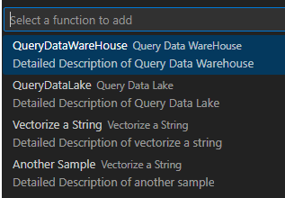

# Fabric User data functions Samples 
You can find these sample functions that can be used in Fabric.  These functions can also be found in Fabric portal. 
Samples can be found in DOTNET, PYTHON folders based on the language you want to work with. 

## Index.json 
Index.json defines all the functions that are listed when creating a function in VS Code or Fabric portal. Each tree level is a QuickPick input for the user:

 

index.JSON Format:

```typescript
export interface ISampleFunction {
    name: string; // shown in BOLD on 1st line of QuickPick Item
    description: string; // shown at end of 1st line of QuickPick Item
    detail?: string; // shown on 2nd line of QuickPick Item
    dateAdded?: string; // date added to the repo, so we can sort/filter, like '2024-08-31T17:50:52.184Z'
    tag?: string; // additional tag to filter on
    data: ISampleFunction[] | string; // if string, it's the full relative path file name from root to download. Else it's an array of ISampleFunction
}

```

Additional filtering, sorting by user may be added in the future with tag, dateAdded

NOTE: These are not complete runnable samples. They are snippets that are inserted in User data function item in Fabric. 

## Contributing 

You can contibute to more function samples here. Follow the structure 
- Start with a comment block describing the code, indicating any changes in usings/packagereferences or imports/requirements.txt
- Fabric User data function code snippet
  
### DOTNET Samples
Indent the sample by 8 spaces: the text will be inserted in the FabricFunctions.cs  before the last 2 closing braces

### PYTHON Samples
The text will be inserted at the end of the function_app.py file
